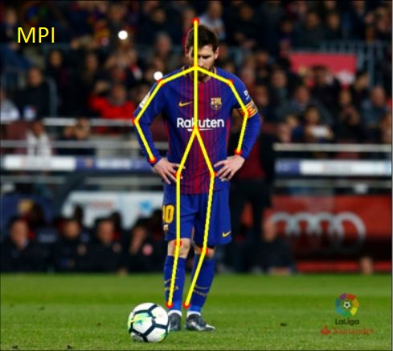
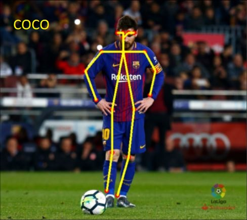

# OpenPose
Through this OpenPose model, we can detect some key body points/joints such as - shoulders, waist, elbows, head etc. This concept has proven to be very useful in auto video/image analysis using computers to detect human motion, pose etc.

I have implemented two models, which are made for the purpose mentioned above. Namely MPI model ( derived and trained from the dataset used from MPII - Max Plank Institute of Informatics) and COCO model ( derived and trained from the dataset used from COCO - Common Objects in Context). Both the models give high accuracy results, and just differ in the number of points they map on to the body. The MPI model maps 15 points, whereas the COCO model maps 3 extra, 18 points in total. As depicted in the images below - 

### Note -
The below are the pretrained model weights that need to be downloaded, and placed in the appropriate folders in the folder 'pose'.
COCO: http://posefs1.perception.cs.cmu.edu/OpenPose/models/pose/coco/pose_iter_440000.caffemodel                                
MPI: http://posefs1.perception.cs.cmu.edu/OpenPose/models/pose/mpi/pose_iter_160000.caffemodel
